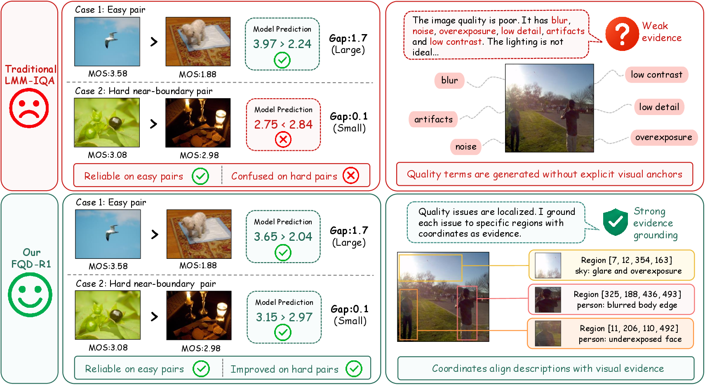
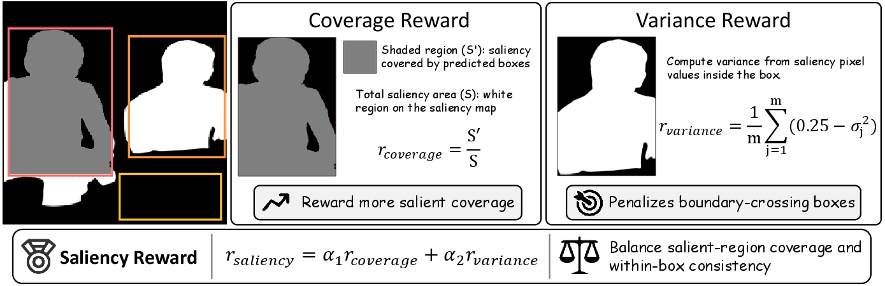

<div align="center">

<h2>FQD-R1: Fine-Grained Quality Decision via Ambiguity-Aware Memory and Saliency-Grounded Reasoning</h2>

[](https://github.com/1Ashe/FineQuality-R1)
[](LICENSE)

</div>

> Official implementation of FQD-R1, a fine-grained no-reference image quality assessment framework for near-boundary ranking and spatially grounded quality reasoning.

<div align="center">
  
</div>

**Motivation.** Existing LMM-IQA methods can rank easy pairs with large quality gaps, but often struggle with near-boundary pairs and weakly grounded explanations. FQD-R1 improves subtle quality ranking while anchoring each decision to localized visual evidence.

<div align="center">
  
</div>

**Saliency reward.** Coverage rewards predicted regions that capture salient content, while the variance term penalizes boxes that cross saliency boundaries or cover heterogeneous regions.

## Environment setup

Quickly create the `fqd` Conda environment with the packages required to run our training scripts.

```bash
conda create -n fqd python=3.11.10
conda activate fqd

export CUDA_HOME="<CUDA_HOME>"
bash setup.sh
```

Replace `<CUDA_HOME>` with the path to the local CUDA toolkit.

## 🚀 Quick Training

Prepare a local Qwen2.5-VL checkpoint, an RGB image directory, a grayscale saliency-image directory, and a training JSONL file. The RGB and saliency directories must use matching filenames and relative paths. Every JSONL record must contain `id`, `dataset_name`, `image`, and `conversations`; `id` values must be unique, consecutive, and start from `1`.

Edit [`one_node_run_kadid.sh`](src/open-r1-multimodal/run_scripts/KADID-10K/one_node_run_kadid.sh) and replace:

- `<MODEL_NAME_OR_PATH>`
- `<IMAGE_FOLDER>`
- `<GRAY_IMAGE_FOLDER>`
- `<DATA_FILE_PATH>`

Set `--nproc_per_node` to the number of GPUs, then run from the repository root:

```bash
conda activate fqd
bash src/open-r1-multimodal/run_scripts/KADID-10K/one_node_run_kadid.sh
```

Checkpoints are written to `src/open-r1-multimodal/output/<RUN_NAME>`. Reward logs follow `LOG_PATH`; hard-sample mining does not create a separate log file.

## 😺 Acknowledgements

This repository builds on [VisualQuality-R1](https://github.com/TianheWu/VisualQuality-R1) and [Open R1](https://github.com/huggingface/open-r1). We thank their authors for releasing their work.

## 🏷️ License

This project is released under the [Apache License 2.0](LICENSE).
